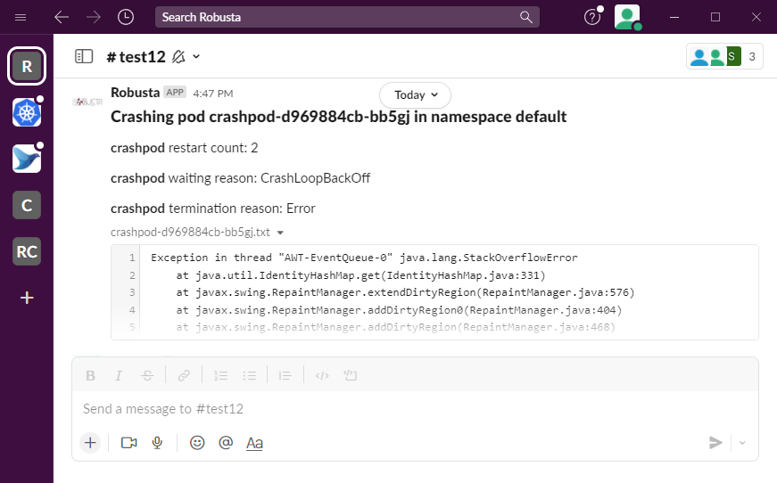
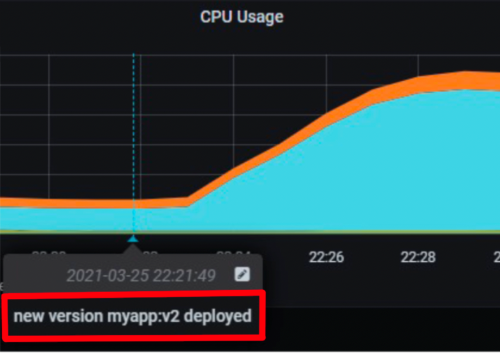
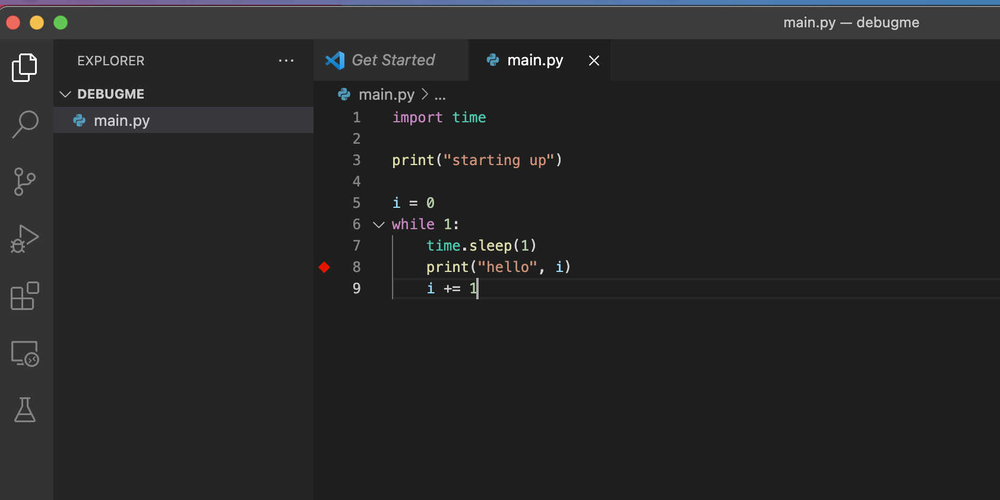
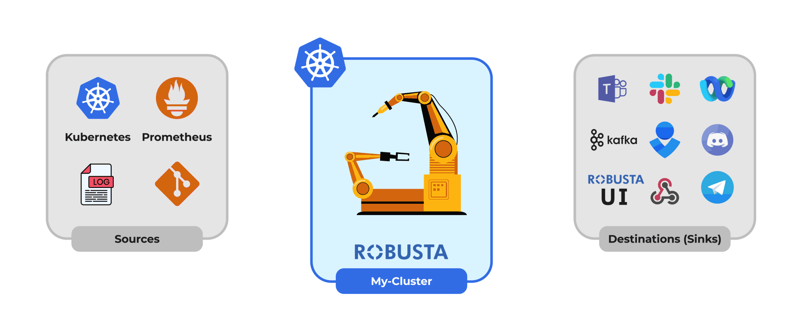

import Tabs from '@theme/Tabs';
import TabItem from '@theme/TabItem';

# Welcome to Robusta

Robusta is an open source platform for Kubernetes troubleshooting. It sits on top of your monitoring stack
(Prometheus, Elasticsearch, etc.) and tells you why alerts occurred and how to fix them.

Robusta has three main parts, all open source:

1. An automations engine for Kubernetes
2. Builtin automations to enrich and fix common alerts
3. Manual troubleshooting tools for everything else

There are additional *optional* components:

4. [An all-in-one bundle with Robusta, the Prometheus Operator, and default Kubernetes alerts](https://home.robusta.dev/prometheus-based-monitoring/?from=docs)
5. [A web UI to see all alerts, changes, and events in your cluster](http://home.robusta.dev/ui?from=docs)

### Example Use Cases

<Tabs>
  <TabItem value="Crashing Pod" label="Crashing Pod" default>
    Monitor crashing pods and send their logs to Slack

  
  </TabItem>
  <TabItem value="Event Correlation" label="Event Correlation">
    Show application updates in Grafana to correlate them with error spikes

  
  </TabItem>
  <TabItem value="Debug Pods" label="Debug Pods">
    Attach the VSCode debugger to a running Python pod without tearing your hair out

  

    `robusta playbooks trigger python_debugger name=podname namespace=default`

  </TabItem>
</Tabs>


### How it works

Robusta automates everything that happens **after** you deploy your application.

It is somewhat like Zapier/IFTTT for devops, with an emphasis on prebuilt automations and not just "build your own".

For example, the following automation sends logs to Slack when an alert fires for crashing pods:

```yaml

    triggers:
      - on_prometheus_alert:
          alert_name: KubePodCrashLooping
    actions:
      - logs_enricher: {}
    sinks:
      - slack
```

Every automation has three parts:


- :__Triggers__

     When to run (on alerts, logs, changes, etc)
        { .annotate }

- :__Actions__

    What to do
        (over 50 builtin actions)

- :__Sync__

    Where to send the result
        (Slack, etc)




### Writing your own automations

Many automations are included, but you can also write your own in Python.

example "View example action (Python)"


```python 
        # this runs on Prometheus alerts you specify in the YAML
        @action
        def my_enricher(event: PrometheusKubernetesAlert):
            # we have full access to the pod on which the alert fired
            pod = event.get_pod()
            pod_name = pod.metadata.name
            pod_logs = pod.get_logs()
            pod_processes = pod.exec("ps aux")

            # this is how you send data to slack or other destinations
            event.add_enrichment([
                MarkdownBlock("*Oh no!* An alert occurred on " + pod_name),
                FileBlock("crashing-pod.log", pod_logs)
        ])
```

### Next Steps

`Ready to install Robusta? Get started! <installation>`

[Star us on GitHub to receive updates.](https://github.com/robusta-dev/robusta/)
